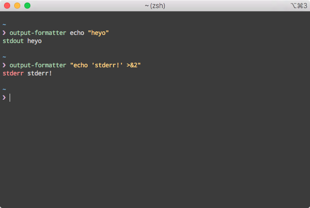

# output-formatter
Annotate/prefix command output. Only works on computers with bash installed.



# Install

On Mac you can do: 

```
brew install https://raw.githubusercontent.com/rabbit-ci/output-formatter/master/output-formatter.rb
```

Everything else is:

```
go get -u github.com/rabbit-ci/output-formatter
```

# Usage

```
output-formatter your command
```

Disclaimer: arguments passed to output-formatter will be joined into a string and sent to "bash -c". This allows for things like `"echo 'bleh' >&2"` to be run and show up as stderr. This means that `output-formatter echo "Isn't it cool?"` will fail because the `"`'s are removed and it's actually running: `bash -c echo Isn't it cool?`. Fix this by quoting the whole command: `output-formatter "echo \"Isn't it cool?\""`.
